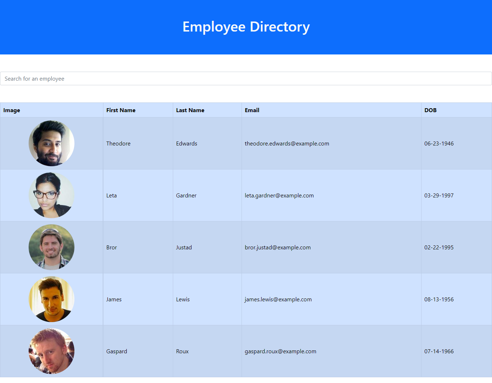

# Employee Directory React

## 

## Table of Contents

- [Description](#Description)
- [Installation Instructions](#Installation-Instructions)
- [Usage Information](#Usage-Information)
- [Contribution Guidelines](#Contribution-Guidelines)
- [Test Instructions](#Test-Instructions)
- [GitHub Page](#GitHub-Page)
- [Questions](#Questions)

## Description

This is an employee directory coded with React. Users can view a list of employees, and they can type in the search box to filter by their names and emails. Users can also sort these categories.

This app is deployed on GitHub and is available at the following link:

https://runescape11111.github.io/employee-directory-react/

## Installation Instructions

```
N/A
```

## Usage Information

Upon reaching the page, the page will automatically fetch randomly generated information from https://randomuser.me/api/, and the fetched information will be used to populate the page by rendering a table element. The table has the following columns: image, first name, last name, email, and date of birth. The image column displays the employees' profile picture, and the DOB column displays their DOB in MM-DD-YYYY format.

A search box is present above the table. When users begin typing in the input box, the employee list will automatically be filtered so that the user can search by name and/or email. For these columns, the user can also click on the column header to sort employees by that column in ascending order; clicking again will sort by descending order.

## Sample Page

### Page with employee information



## Contribution Guidelines

```
N/A
```

## Test Instructions

```
N/A
```

## GitHub Page

https://github.com/runescape11111/employee-directory-react

## Questions

GitHub profile: github.com/runescape11111/

Email: olivershih@gmail.com
